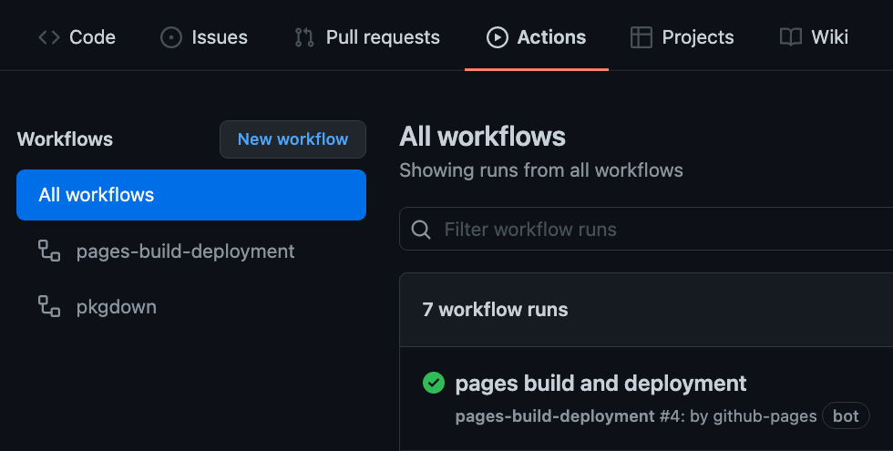

```{r setup, include=FALSE}
options(htmltools.dir.version = FALSE)
knitr::opts_chunk$set(
  fig.width=9, fig.height=3.5, fig.retina=3,
  out.width = "100%",
  cache = FALSE,
  echo = TRUE,
  message = FALSE, 
  warning = FALSE,
  hiline = TRUE
)
```


class: inverse,center
background-image: url("slides_files/RLadies\ bg.png")
# Required R pkgs 


---
# R data pkg instructions 📄

## GitHub 1st (recommended)

- GitHub > create new repository > NAME, Public and README
- copy the HTTPS url link
- RStudio File > New Project > Version Control 
- paste in the url
- in the console: 

```
library(devtools)
library(roxygen2)
library(usethis)

# install.packages("here")
here::here()    # for pkg management

create_package(path=".") 
# this creates a pkg inside a repo instead of a folder
```

You want to override existing package, a new RStudio session will open 
and will have the Build tab on top right panel.

**Credit:**
This content is mostly from **Allison Hill** and the **r4edu** [Book](https://rstudio4edu.github.io/rstudio4edu-book/), chapter 12. 


---
# Necessary files 🔺

In the Files folder you should see

- `.gitignore`
- `.Rbuildignore`
- `DESCRIPTION`
- `NAMESPACE`
- `.RData`
- `.Rhistory`
- `<your-pkg-name>.Rproj`
- `R/`

commit and push to GitHub. 


---
# Add data 📔 📶

Any `.R` file or files used for pre-processing goes into `data-raw/`

```
usethis::use_data_raw()  # This creates a data-raw folder.
```

add content in the `DATASET.R` file, 
add whatever, *it does not impact the use of your package*.

You could have inside the DATASET.R file

| Idea   1                     | Idea 2   |
|------------------------------|----------|
| starwars =  dplyr::starwars  | library(tidytuesdayR) |
| starwars = starwars          | tuesdata = tidytuesdayR::tt_load('2021-12-14') |
|                              | studio_album_tracks = tuesdata$studio_album_tracks |
| usethis::use_data(starwars, overwrite = TRUE) | usethis::use_data(studio_album_tracks, overwrite = TRUE) |

1. load `library()` / libraries
2. **read in the data** & data clean (if you want)
3. `usethis::use_data()`
4. hit the **source** button, this creates a data/ folder


---
# Build & Load it  🏗️

In RStudio: Build tab > More > Load All. This loads all of your .R and data files.


Now in the console, type the `YOUR_PACKAGE`::`SPECIFIC_DATASET`


this will load the dataset.


This is my RLadiesData package and the datasets I have.


---
# Check it ✅

You want to do some checks on the pkg, in the console

`devtools::check()`

commit & push to GitHub


---
# Document the dataset(s) 📄

In console: `usethis::use_r("DATASET_NAME")` . Repeat this for each dataset you 
have. And in the new .R file, add **roxygen** comments, I use `devtools::document()`.

There are **three main ways** to run roxygen:

- *`roxygen2::roxygenise()`* | *`Ctrl + Shift + D`* | *`devtools::document()`*.  


For further details, click [Roxygen docs](https://cran.r-project.org/web/packages/roxygen2/vignettes/roxygen2.html)

Roxygen comments look like this:
```
#' RLadiesData
#' The World Happiness Report (2016) ranks 156 countries by their happiness levels.
#' @format A tibble with 157 rows and 14 variables:
#' \describe{
#'   \item{Country}{chr The name of the Country}
         .
         .
         .
#' }
#' @source \url{RLadies Freiburg}
"Happiness"
``` 


---
# Help file ❓️📄

To get the help file to your dataset in your package,
in the console you type `?DATASET_NAME` to get the file to open in the **Help** tab.


#### Test this out for each of your datasets

For this example I typed `?Happiness`


---
# Document the pkg 📄

This is when you open the DESCRIPTION file, and edit the content with your information.

You should see 
```
Package: NAME OF YOUR PACKAGE
Title: NAME OF YOUR PACKAGE
Version: 0.0.1
Authors@R: 
    person("FIRST", "LAST", , "FAKE@email.com", role = c("aut", "cre"),
           comment = c(ORCID = "YOUR-ORCID-ID"))
Description: What the package does (one paragraph).
License: CC BY 4.0
Encoding: UTF-8
Roxygen: list(markdown = TRUE)
RoxygenNote: 7.1.2
Depends: 
    R (>= 2.10)
LazyData: true
URL: https://YOUR_GITHUB-NAME.github.io/PACKAGE_NAME
```


---
# Check it ✅ ✅

You want to do some checks on the pkg, in the console

`usethis::use_package_doc()`

`devtools::document()`

`devtools::check()`

This is when you want to use a license, an option is:
`usethis::use_agpl_license()` but there are many others.

commit & push to GitHub


---
# Install it ⬇️

This is when you get to install your own package!

- `devtools::install("path-to-github-pkg")` 
- `remotes::install_github()`
- ex: `remotes::install_github("PythonCoderUnicorn/RLadiesData")`

Then load **your package**

- `library("your-pkg-name")` 
- `pkgName::dataset1`


---
# GitHub Pages 📄💻

Every respectable R package has a website for the package, you can make this
happen with 1 function call! 

In the console, type `usethis::use_pkgdown_github_pages()`


**commit & push to GitHub**. Then go to **Actions** tab, where you will see
`pkgdown` do the function calls to make your pkg website that includes your
vignettes. You need to click on top / first workflow to get it started, at the end you will have a active **url link** which is automatically posted in your README.




---
# Pkg Delivery 📦 🚚

This is when you edit your README file and post the very useful code of how to install 
your package.

To have code that a person can copy & paste, use 3 ` (back ticks) before and after the 
code.

### Install package

'''
```
remotes::install_github("YOUR-GITHUB/your_datapkg")
```
'''

Then do the same for the `library()` so they can load your package.

### A good documented README file matters! It's free marketing and advertising of your package

Tell the world *why* they should use your package. Show use cases and post 
images of plots if your package uses plotting. 


---
# Congrats !! 🥳 🍹

## YOU just made a dataset package!! 


Search GitHub for your package ->

***Now what?***

- Tell the world ! 
- add this to resume or CV
- make a hex logo for your package
- improve your pkg


---
class: inverse, middle, center

# The End


---
# Thank you 🌷

- **Thank you** RLadies for this opportunity 🍁

Hope you enjoyed this and practice.


