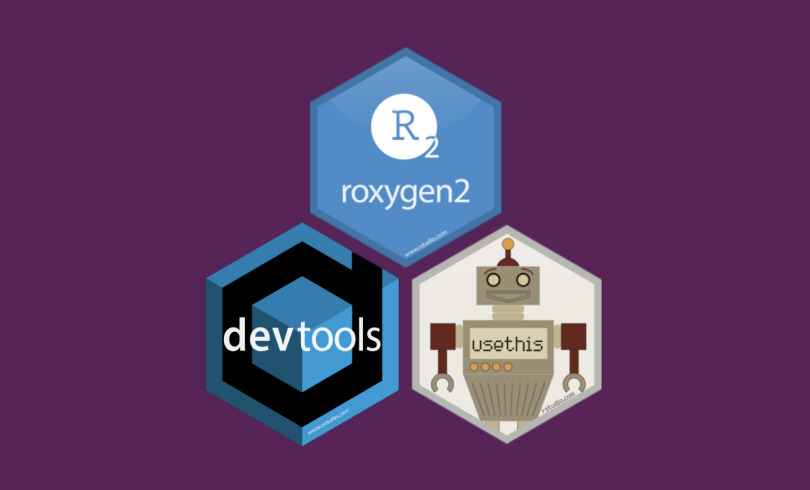
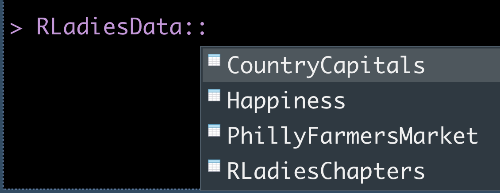
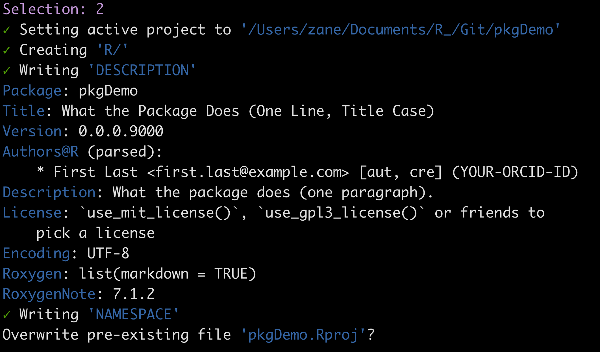
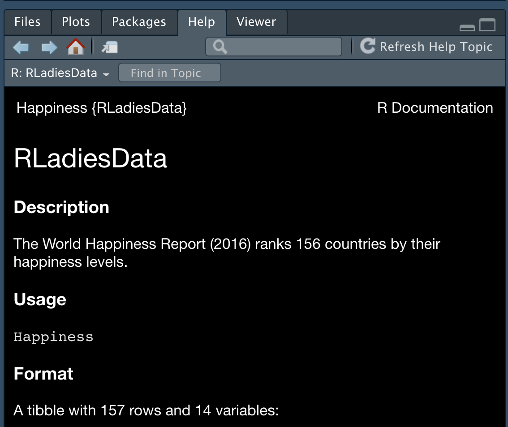
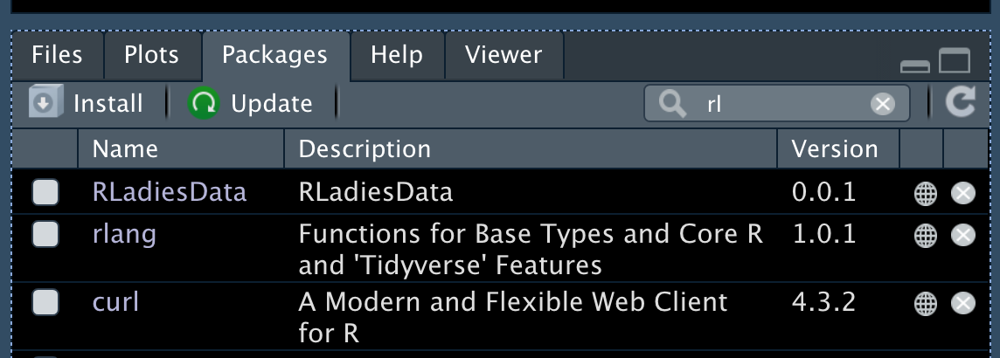
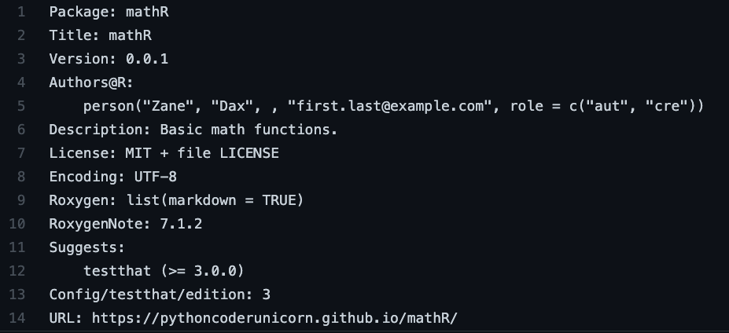
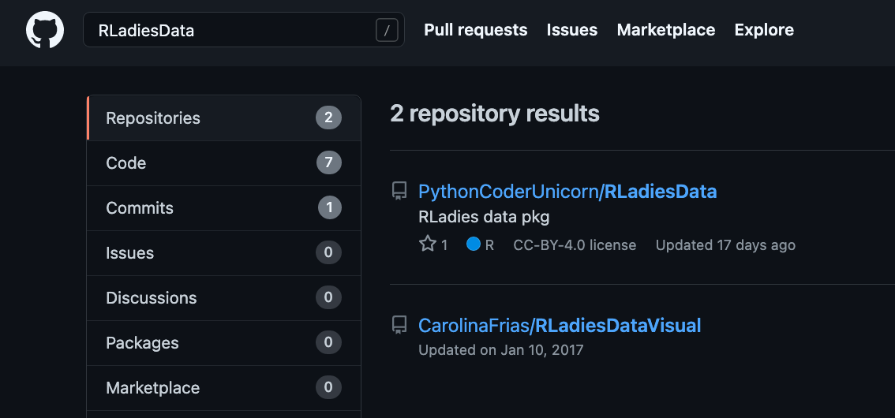
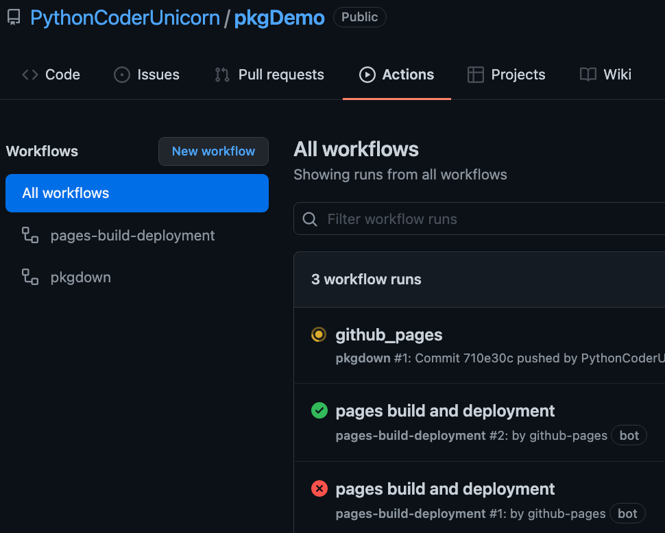
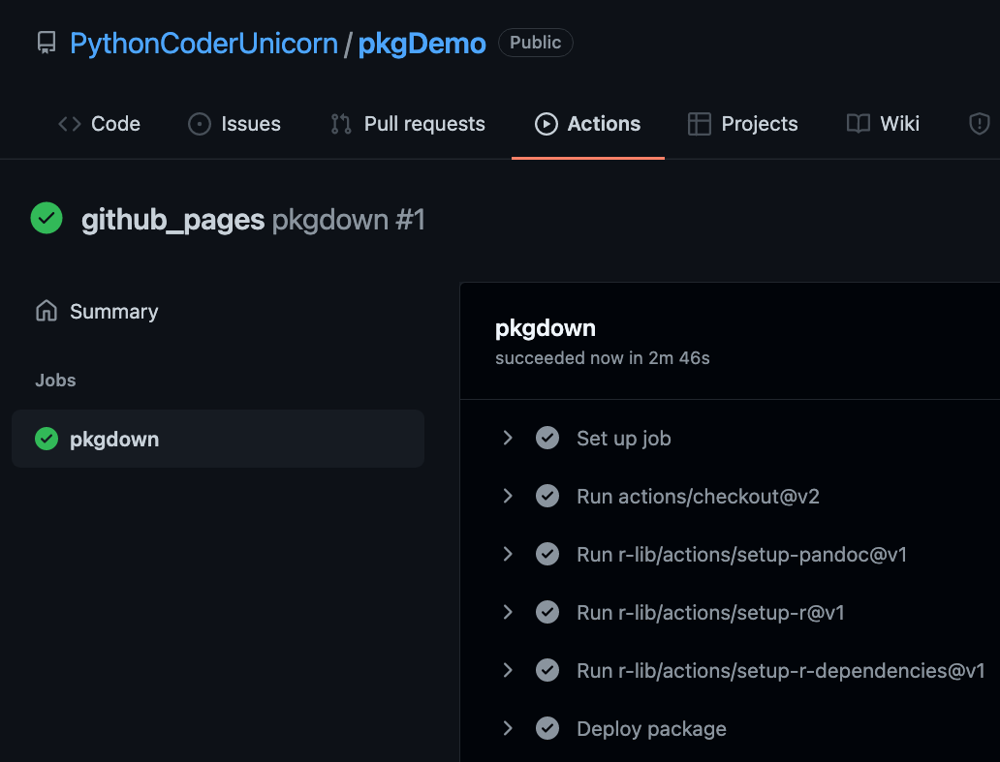
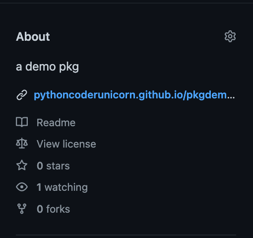

```{r setup, include=FALSE}
options(htmltools.dir.version = FALSE)
knitr::opts_chunk$set(
  fig.width=9, fig.height=3.5, fig.retina=3,
  out.width = "100%",
  cache = FALSE,
  echo = TRUE,
  message = FALSE, 
  warning = FALSE,
  hiline = TRUE
)
```


class: inverse,center
background-image: url("slides_files/RLadies\ bg.png")
# Required R pkgs 



---
# R pkg instructions

## Option 1 - GitHub 1st (recommended)

- copy the HTTPS url link
- RStudio File > New Project > Version Control 
- paste in the url
- in the console: `library(devtools)`
- in the console: `create_package(path=".")`


## Option 2 - GitHub 2nd

- build pkg BEFORE **GitHub**
- top right tab in RStudio **Project (none)** > New Project
- New Directory > R Package > give package a name


---
# Initial start - 1.1


In the console you type in `library(devtools)` and `create_package(path='.')`

loading the `library(here)` is a very good idea as well.

The path is set to `'.'` to avoid building a package inside a folder.

If you select either "no" options, nothing will happen.


---
# Initial start - 1.2



---
# Step 2

RStudio opens a new window session, this is where you need to
type in the console:

```
library(devtools)
library(testthat)
library(usethis)
```

After loading the libraries do an initial check
`devtools::check()`

You will likely see a **warning** (in green) about the LICENSE of your package. If you wish to deal with this now instead of later
run: `use_mit_license()` in the console.


If your package will be using the magrittr %>%, you can load it now using `use_pipe()` and then `document()`. The `use_pipe()` creates a .R file inside the R folder and `document()` creates a NAMESPACE object.


---
# Step 3 - Functions!

Now is the time to start building functions for your package.
The essential code you need for each function is: 

- `use_r("NAME_OF_YOUR_FUNCTION")` . This opens up a .R file

Some tutorials add **Roxygen** code later into this .R file, I like to do it at the same time as creating your function. Roxygen code starts with # + back tick. This example is `use_r("add")`. This slide shows only bare minimum for roxygen code, for full details read [roxygen documentation](https://roxygen2.r-lib.org/articles/roxygen2.html)

### inside the .R file
```
#'@title Add two vectors
#'@description
#'This function ...
.
.
.
add <- function(x, y){
  x + y
}
```

Then run `document()` and after you do this for each function, run 
`load_all()`


---
# Step 4 - Call your function

In the console, type `add(3,5)`. You should see it suggested with the name
of your package, for this tutorial I named my package "pkgDemo".




---
# Step 5 - Test it/ Test that

In the console type `use_testthat()` and 
then `use_test('add')` etc. for all of your functions you made.
This creates a unit test for the function. Since we dealt with the LICENSE warning earlier we see all 3 green checkmarks.

The test will create a Test folder and will open a test file. This is where you do all your **unit testing** for you function(s) against all use cases. After you do unit tests, run `check()` in the console.




---
# Step 6 - Vignettes & Description

You can have vignettes on how to use your functions in your package, by running the code `install(build_vignettes = TRUE)` in the
console. This step is when you would want to edit the DESCRIPTION file, which is the basic information about your package. This is from my mathR pkg description file.




---
# Step 7 - Install your package!

After you commit and pushed your code along the way, 
you now can install your very own package! In the RStudio right side, Packages tab > search for your package
and it's not there, not yet but soon!

In the console: 
`devtools::install_github("your_GITHUB_NAME/your_PKG_NAME")`




---
# Step 8 - GitHub pages

This step is all about automating your GitHub pages webpage and having it posted in the README file. 

In the console: `usethis::use_pkgdown_github_pages()` then commit and push your changes to your GitHub. Then go to the **Actions** section.




---




---
# GitHub pages

After `pkgdown` does the magic and finished it work, you should
see a active link to your package documentation.




---
# Congrats !!

You just made a R package !

Now the fun is to go back and make changes to files, add more
functions and descriptions of functions.


